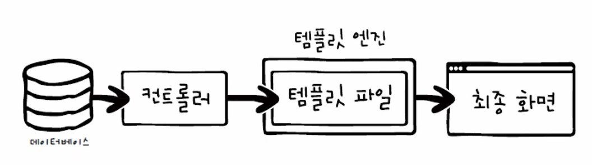

# 4주차

# 웹 애플리케이션 완성하기

**템플릿 엔진**

템플릿 파일을 만들고 데이터베이스에서 가져온 동적인 데이터를 템플릿 파일에 연결하는 역할

**템플릿 파일**

데이터베이스에서 가져온 데이터의 값을 어느 위치에 넣을지 미리 만들어 놓은 틀



## EJS엔진

콘솔에서 아래 명령어를 통해 설치

```jsx
npm i ejs
```

app.js에 아래 코드를 추가하여 엔진을 세팅

```jsx
app.set("view engine", "ejs");
app.set("views", "./views");
```

`/view` 폴더에 템플릿 파일 `getAll.ejs` 을 생성하고, 이것을 컨트롤러 파일 `contactController.js`에서 불러와 사용할 수 있다.

```jsx
res.render("ejs filename", {var: 전송하고자 하는 자료});
```

```jsx
const getAllContacts = asyncHandler(async (req, res) => {
  // 전체 연락처 보기
  const users = [
    { name: "Kim", email: "kim@abc.def", phone: "12345" },
    { name: "Lee", email: "lee@abc.def", phone: "56789" },
  ];

  **res.render("getAll", { users: users });**
});
```

```html
<!DOCTYPE html>
<html lang="en">
  <head>
    <meta charset="UTF-8" />
    <meta http-equiv="X-UA-Compatible" content="IE=edge" />
    <meta name="viewport" content="width=device-width, initial-scale=1.0" />
    <title>Get All Contacts</title>
    <link
      rel="stylesheet"
      href="https://cdnjs.cloudflare.com/ajax/libs/font-awesome/6.4.0/css/all.min.css"
      integrity="sha512-iecdLmaskl7CVkqkXNQ/ZH/XLlvWZOJyj7Yy7tcenmpD1ypASozpmT/E0iPtmFIB46ZmdtAc9eNBvH0H/ZpiBw=="
      crossorigin="anonymous"
      referrerpolicy="no-referrer"
    />
    <style>
      * {
        margin: 0;
        padding: 0;
      }
      body {
        display: flex;
        flex-direction: column;
        justify-content: center;
        align-items: center;
        height: 100vh;
      }
      h1 {
        font-family: Arial, Helvetica, sans-serif;
        font-size: 3em;
        margin-bottom: 20px;
      }
      h1 i {
        margin-right: 0.8em;
      }
      h2 {
        margin-bottom: 15px;
      }
    </style>
  </head>
  <body>
    <h1><i class="fa-solid fa-address-card"></i>Contacts Page</h1>
    **<h2>Users</h2>
    <% users.forEach ( user => { %>
    <li><%= user.name %></li>
    <%}); %>**
  </body>
</html>
```

템플릿 파일에서 동적인 콘텐츠 처리

```jsx
<%= 변수 %>
<% 자바스크립트 코드 %>
<%- HTML 코드 %>
```

## 전체 연락처 표시하기

다음과 같이 템플릿 파일을 작성하여 DB로부터 불러온 데이터를 화면 상에 렌더링 할 수 있다.

이때, 다른 파일과 동일한 내용이 반복되는 header의 내용은 별도의 `_header.ejs` 파일로 작성하여 분리할 수 있다.

```html
<%- include("./include/_header") %>

<!-- Main -->
<main id="site-main">
  <div class="button-box">
    <a href="#" class="btn btn-light"
      ><i class="fa-solid fa-user-plus"></i>연락처 추가</a
    >
  </div>

  <table class="table">
    <thead>
      <tr>
        <th>이름</th>
        <th>메일 주소</th>
        <th>전화번호</th>
        <th>&nbsp;</th>
      </tr>
    </thead>
    <tbody>
      <% contacts.forEach( contact => { %>

      <tr>
        <td><%= contact.name %></td>
        <td><%= contact.email %></td>
        <td><%= contact.phone %></td>
        <td>
          <a href="#" class="btn update" title="수정">
            <i class="fas fa-pencil-alt"></i>
          </a>
          <a href="#" class="btn delete" title="삭제">
            <i class="fas fa-times"></i>
          </a>
        </td>
      </tr>
      <% }) %>
    </tbody>
  </table>
</main>
<!-- /Main -->
<%- include("./include/_footer") %>

```

## 연락처 추가하기

add.ejs

form에 `action=”/contacts/add”` 옵션을 주어 해당 경로로 POST 요청을 보내도록 함

이때, contactRoutes 파일에서 라우팅한 함수를 호출하게 됨

```jsx
const express = require("express");
const router = express.Router();

const {
  getAllContacts,
  createContact,
  getContact,
  updateContact,
  deleteContact,
  addContactForm,
} = require("../controllers/contactController");

router.route("/contacts").get(getAllContacts);
router.route("/contacts/add").get(addContactForm).post(createContact);
router
  .route("/contacts/:id")
  .get(getContact)
  .put(updateContact)
  .delete(deleteContact);

module.exports = router;

```

## 연락처 수정/삭제하기

`*<*form method="PUT" id="add-user"*>*`

위와 같이 PUT을 바로 사용하게 되면 서버에서 인식하지 못하는 문제가 있다. 

따라서 method overriding 방식을 이용하여 POST로 보낸 요청을 서버 단에서 PUT으로 처리하도록 해야 한다.

method-override 패키지 설치

```jsx
 npm i method-override
```

app.js에 미들웨어 등록

```jsx
const express = require("express");
const dbConnect = require("./config/dbConnect");
**const methodOverride = require("method-override");**

const app = express();

app.set("view engine", "ejs");
app.set("views", "./views");

app.use(express.static("./public"));

**app.use(methodOverride("_method"));**

dbConnect();

app.get("/", (req, res) => {
  res.send("Hello, Node!");
});

app.use(express.json());
app.use(express.urlencoded({ extended: true }));

app.use("/", require("./routes/contactRoutes"));

app.listen(3000, () => {
  console.log("서버 실행 중");
});

```

아래와 같이 method-overriding 수행

```html
  <form
    action="/contacts/<%= contact._id %>?_method=PUT"
    method="POST"
    id="add-user"
  >
```

redirect 함수를 통해 메인 화면으로 리다이랙트 되도록 함

```jsx
// @desc Update contact
// @route PUT /contacts/:id
const updateContact = asyncHandler(async (req, res) => {
  // 연락처 수정하기
  const id = req.params.id;
  const { name, email, phone } = req.body;
  const contact = await Contact.findById(id);
  if (!contact) {
    throw new Error("Contact not found.");
  }
  contact.name = name;
  contact.email = email;
  contact.phone = phone;
  contact.save();

  **res.redirect("/contacts");**
});

```

## 로그인 처리하기

```jsx
const asyncHandler = require("express-async-handler");

// Get login page
// GET /
const getLogin = (req, res) => {
  res.render("home");
};

// Login user
// POST /
const loginUser = asyncHandler(async (req, res) => {
  const { username, password } = req.body;

  if (username === "admin" && password === "1234") {
    res.send("Login success");
  } else {
    res.send("Login failed");
  }
});

module.exports = { getLogin, loginUser };

```

## 관리자 등록하기

로그인 정보 저장을 위한 DB schema 세팅

```jsx
const mongoose = require("mongoose");
const Schema = mongoose.Schema;

const UserSchema = new Schema({
  username: {
    type: String,
    required: true,
    unique: true,
  },
  password: {
    type: String,
    required: true,
  },
});

module.exports = mongoose.model("User", UserSchema);
```

비밀번호를 암호화하기 위해 bcrypt 모듈을 사용하여 해시화 한다.

```jsx
bcrypt.hash(data, saltRounds, callback)
```

비밀번호를 확인할 때에는,
사용자가 입력한 비밀번호를 해시한 후, 데이터베이스에 있는 해시값과 같은지 확인한다.

```jsx
bcrypt.compare(data, encrypted, callback)
```

```
// Register user
// POST /register
const registerUser = asyncHandler(async (req, res) => {
  const { username, password1, password2 } = req.body;
  if (password1 === password2) {
    const hashedPassword = await bcrypt.hash(password1, 10);
    const user = await User.create({ username, password: hashedPassword });
    res.json({ message: "Register successful", user });
  } else {
    res.send("Register Failed");
  }
});
```

## 사용자 인증하기

**JWT(Json Web Token)**


```jsx
const asyncHandler = require("express-async-handler");
const User = require("../models/userModel");
const bcrypt = require("bcrypt");
require("dotenv").config();
const jwtSecret = process.env.JWT_SECRET;
const jwt = require("jsonwebtoken");

// Login user
// POST /
const loginUser = asyncHandler(async (req, res) => {
  const { username, password } = req.body;

  const user = await User.findOne({ username });
  if (!user) {
    return res.json({ message: "일치하는 사용자가 없습니다." });
  }

  const isMatch = await bcrypt.compare(password, user.password);
  if (!isMatch) {
    return res.json({ message: "비밀번호가 일치하지 않습니다." });
  }

  const token = jwt.sign({ id: user._id }, jwtSecret);
  res.cookie("token", token, { httpOnly: true });
  res.redirect("/contacts");
});
```